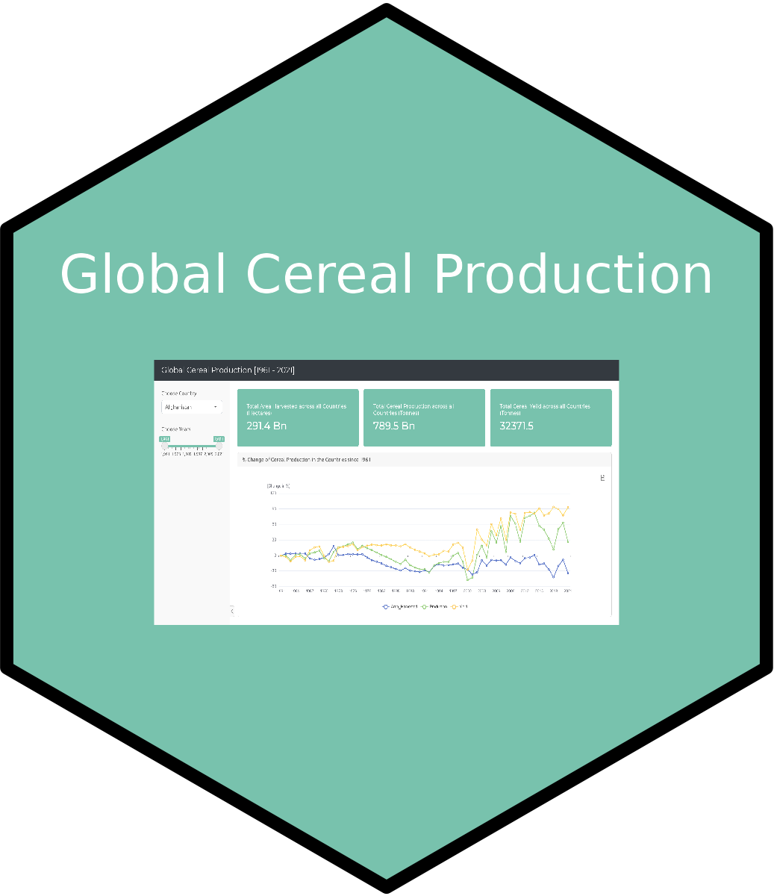
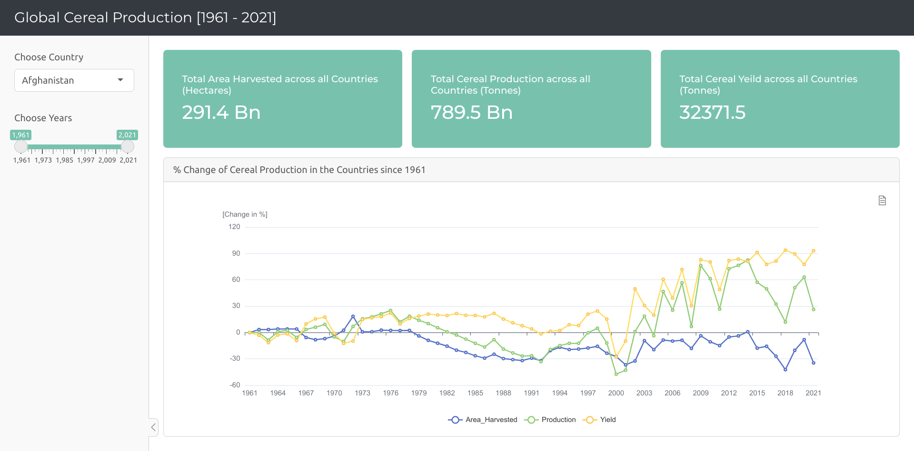

# Global Cereal Harvest Insights: Shiny App

This Shiny app visualizes data on global cereal production, offering insights into the changes in yields and production trends across various countries.

 
 

## Features

- Select a country and specific years to observe the shifts in cereal production.
- Explore the total area harvested, cereal production, and yields across all countries in the dataset.
- Gain a deeper understanding of the changes in production percentages since 1961.

## App Screenshots

### [Check live app here](https://aswanijahangeer.shinyapps.io/Global-Cereal-Production/)

### [Youtube Link](https://youtu.be/CPaO17ursPo)

## Feedback

Your feedback is highly appreciated as I continue to learn and improve my shiny skills. Feel free to open an issue or provide suggestions for enhancements.

### Data Source: [Our World in Data](https://data.world/makeovermonday/2023w24)
